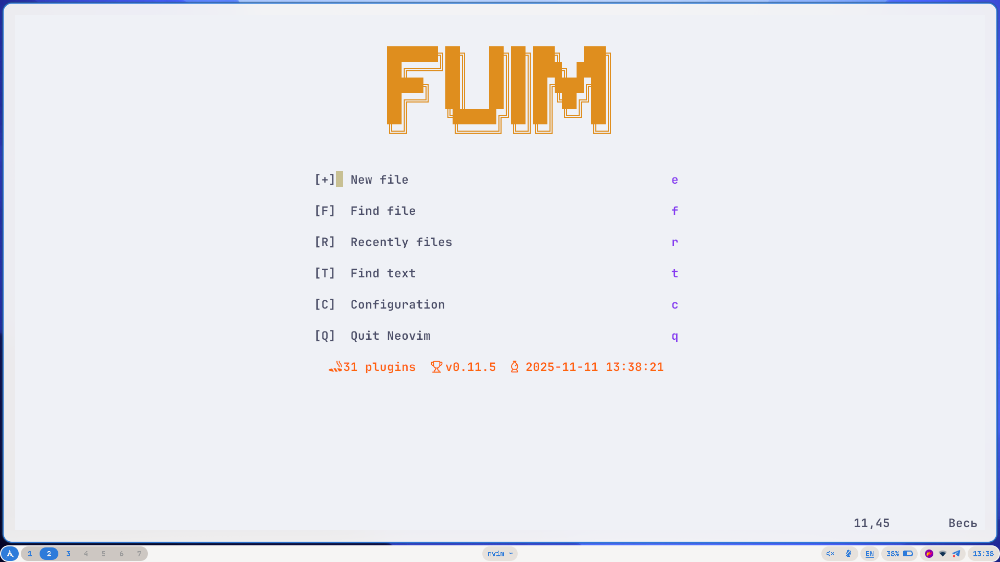
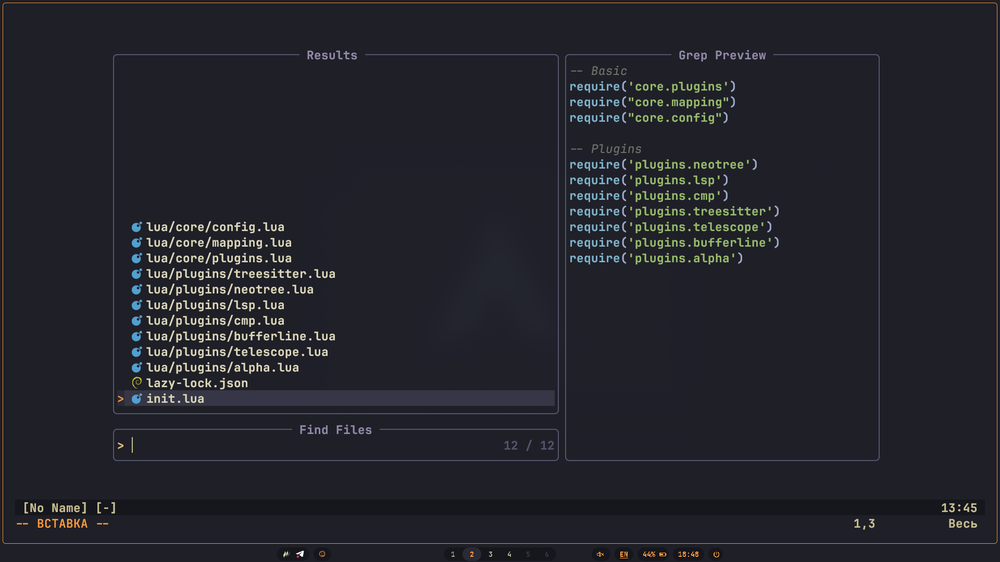
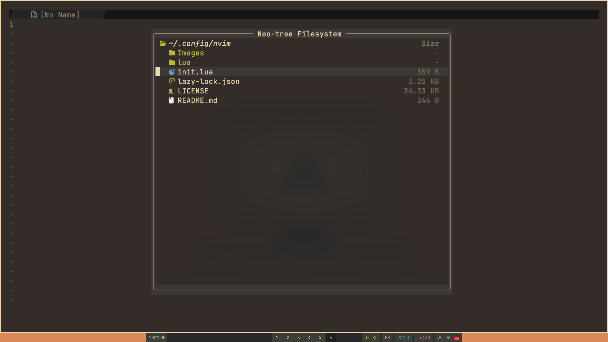
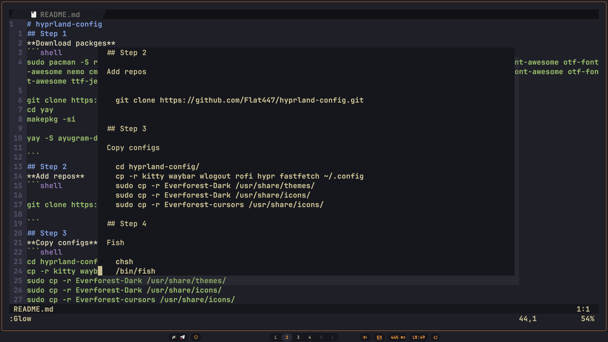
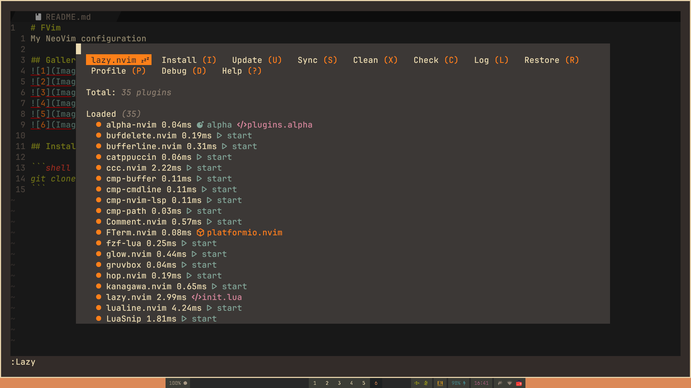
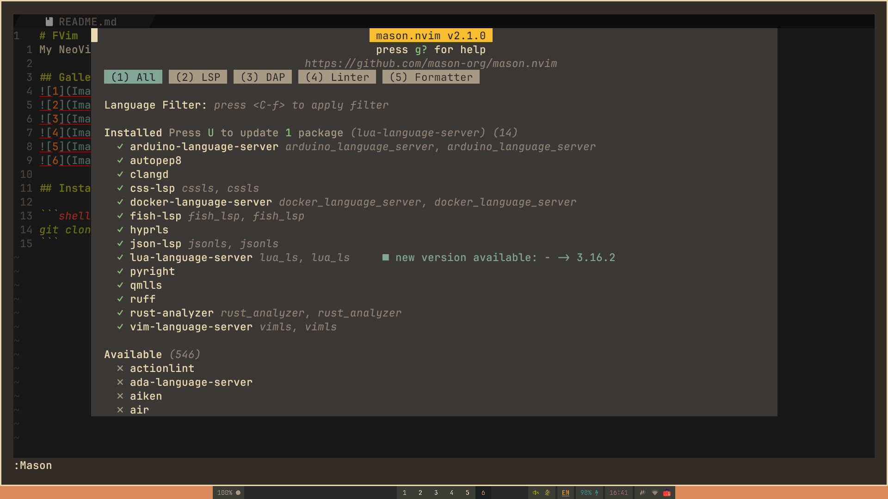

# FVim
My NeoVim configuration

## Gallery:







## Dependencies

[`NeoVim`](https://github.com/neovim/neovim)

[`TreeSitter CLI`](https://github.com/tree-sitter/tree-sitter)

[`RipGrep`](https://github.com/BurntSushi/ripgrep)

[`Python`](https://www.python.org/)

[`NodeJS`](https://nodejs.org/)

[`Vim Plug`](https://github.com/junegunn/vim-plug)

[`Nerd Fonts`](https://www.nerdfonts.com/font-downloads)

[`Glow`](https://github.com/charmbracelet/glow)

## Instalisation

```shell
mv ~/.config/nvim ~/.config/nvim.bak; mv ~/.local/share/nvim ~/.local/share/nvim.bak; mv ~/.local/state/nvim ~/.local/state/nvim.bak # to keep the old configuration
git clone https://github.com/Flat447/FVim ~/.config/nvim
```
